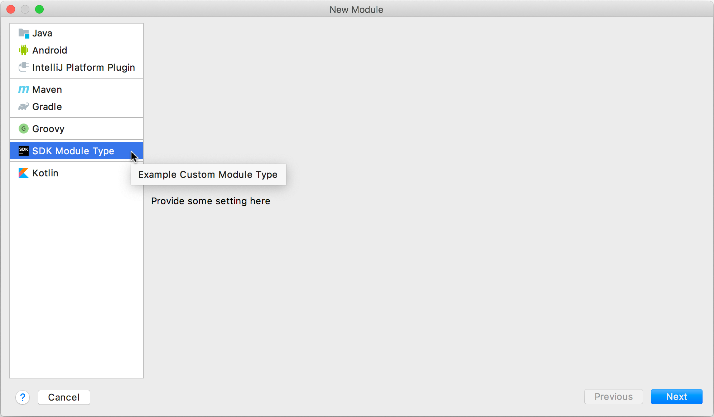

<!-- Copyright 2000-2020 JetBrains s.r.o. and other contributors. Use of this source code is governed by the Apache 2.0 license that can be found in the LICENSE file. -->

*IntelliJ Platform* provides a set of standard module types. However, an application might need a  module of a type that isn't supported yet.
This tutorial shows how to register a new module type and link it to the project creation procedure and the UI.

## Pre-Requirements

Create an empty plugin project, see [Creating a Plugin Project](/tutorials/build_system.md).

> **NOTE** The UI for selecting module types and the creation of modules through project wizard is IntelliJ IDEA-specific.

## 1. Register a New Module Type
Add a new `com.intellij.moduleType` implementation with the IntelliJ Platform in the `plugin.xml` configuration file.

```xml
  <extensions defaultExtensionNs="com.intellij">
    <moduleType id="DEMO_MODULE_TYPE" implementationClass="org.intellij.sdk.module.DemoModuleType"/>
  </extensions>
```

## 2. Implement ModuleType Interface
Create the `DemoModuleType` implementation based on [`ModuleType`](upsource:///platform/lang-api/src/com/intellij/openapi/module/ModuleType.java).

```java

```

## 3. Implement Custom Module Builder
Create `DemoModuleBuilder` based on [`ModuleBuilder`](upsource:///platform/lang-api/src/com/intellij/ide/util/projectWizard/ModuleBuilder.java).

```java

```

## 4. Provide Custom Wizard Steps
Provide a straightforward implementation of UI components for the project creating stage.
Create a generic `DemoModuleWizardStep` based on [ModuleWizardStep](upsource:///platform/lang-api/src/com/intellij/ide/util/projectWizard/ModuleWizardStep.java)

```java

```

## 5. Creating a Module of New Type
After compiling and running the plugin in a development instance, create a new project.
Select **File \| New \| Module...**
A new module type and its settings panel are available in the Project Wizard.

{:width="800px"}

